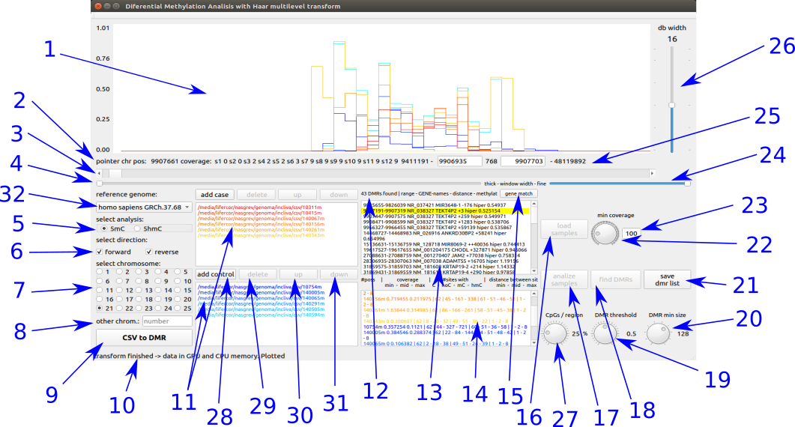

# HPG-Dhunter

**HPG-Dhunter** is a real-time DNA methylation visualizer. It is based on Discrete Wavelet Transform (DWT) analyzer as a Differentially Methylated Regions (DMRs) finder and is the newcomer to the **HPG-Suite**.

*HPG-Suite* began with [**HPG-Methyl**](https://github.com/grev-uv/hpg-methyl), an ultrafast and highly sensitive Next-Generation Sequencing read mapper and methylation context extractor, that works with single-end or paired-end .fastq files and provides .bam files. The following income tool was [**HPG-Hmapper**](https://github.com/grev-uv/hpg-hmapper), a parallel software tool for analyzing DNA hydroximethylation data, that works with the .bam files from HPG-Methyl and provides .csv files, mapping the number of Cs, noCs, 5mCs and 5hmCs reads per position, chromosome and sense (forward, reverse).

HPG-Dhunter is a powerful real-time visualizer tool that uses the high performance parallel computation of GPUs and CUDA application programming interface model for analyze the DNA methylation and show the results, minimizing the CPU-GPU communication.

## Handling
**HPG-Dhunter** shows a user interface (UI) whose design has been developed according to the indications of the INCLIVA researchers in genome biology team. HPG-Dhunter background has been developed from the research about the use of wavelet transform over the methylated files treated like a signal as you can read in this [paper](https://link.springer.com/article/10.1007%2Fs11227-018-2670-5).

The visualization and DMR detection process follows a pipeline that begins selecting the cases and control files. After that, the ratio between the methylated coverage and the total coverage over each chromosome position is calculated and upload to the global memory of the GPU device. With all the data at the GPU, it is possible to draw the wavelet transform signal and to find the DMRs in real-time.

This is the UI:

where:
1. Display area of the methylated signal at the selected region.
2. Shows:
1. pointer position inside the chromosome selected region.
2. maximum coverage per sample at the pointer position zone.
3. Displacement of the selected region displaying the new signal region
4. Modify the width of the displayed signal (number of displayed positions)
5. Select the kind of signal to analyze (mC / hmC)
6. Select the direction to analyze (forward and/or reverse).
7. Select the chromosome to analyze.
8. Select the chromosome to analyze by number (if the number is bigger than 25).
9. Open the batch DMR finder.
10. Application message.
11. List of selected files to analyze and display
  - cold colors (blue) for cases files.
  - hot colors (red) for control files.
12. Shows the number of DMRs found.
13. List of DMRs identified with:
  - initial position .
  - end position.
  - the closest gen name1.
  - the closest gen name2.
  - distance to the nearest gen.
  - ‘+’ number of positions from the beginning of the gen.
  - ‘-’ number of positions until the beginning of the gen.
  - ‘++’ number of positions from the end of the gen until the begining of the DMR.
  - ‘--’ number of positions from the end of the DMR until the begining of the gen.
  - shows about ‘hipo’methylation or ‘hyper’methylation of the controls against the cases.
14. List of data from each sample of the DMR selected in 13
  - number of detected position at sequencing process.
  - minimum, mean and maximum coverage.
  - number of positions with C, no C, mC y hmC.
  - minimum, mean and maximum distance between positions.
15. Filter of detected DMRs, selecting only the areas with one or more position inside the nearest gen region (select ‘+’ and ‘-’, discard ‘++’ y ‘--’).
16. Load the selected files to the RAM of PC computing the ratios and coverages.
17. Load the computed data to the GPU global memory, previously filtered by the minimum coverage of dial 22.
18. Find the DMRs filtered by the threshold of dial 19 and the wavelet transform level of dial 20.
19. Dial to select the threshold for DMR detection.
20. Dial to select the wavelet transform level for signal comparison at DMR detection.
21. Open the file explorer to select folder and file name to save the DMRs founded.
22. Dial to select the minimum coverage of signal.
23. Select directly de minimum coverage of signal.
24. Fine width modification of displayed signal
25. Positions of the gen and display
  - lowest gen position of the samples.
  - left position of displayed signal (hand selectable).
  - number of gen position displayed.
  - right position of displayed gen (hand selectable)
  - highest gen position of the samples.
26. Slider to select the level wavelet transformation of the visualized signal (by the number of positions per region).
27. Dial to select the minimum ratio of methylated positions by region. 
28. Open directory browser to select the directory of each sample.
29. Delete the selected file.
30. Climb one position the selected file.
31. Low one position the selected file
32. Select the chromosome of reference

It can zoom the displayed signal clicking the left mouse button at the first position on the left, dragging the pointer to the right and releasing the clicked button.

If the left mouse button is clicked and released over a position in the displayed signal, a new tab is open at the default web navigator addressing the url https://grch37.ensembl.org/Homo_sapiens/Location_with_the_clicked_position_(± 500 positions)

## System requirements
The HPG-Dhunter visualizer is the next step after HPG-HMapper detector and mapper of the methylated and hidroximethylated regions in the work-flow of HPG-suite. Then, the system requirement needs to be, at least, the same, adding a GPU device.
HPG-Dhunter should work properly in a station with the following set-up:
- A 64 bit Intel CPU compatible with SSE4.2.
- The DNA data for DMR tasks needs as adjacent memory as the number of samples by the length of the largest chromosome to be analized. This parameter has a direct relation with the global memory available of the GPU device. The test was done with 32 MB of RAM.
- The amount of samples that HPG-Dhunter can analize at the same time is directly dependent with the amount of the device memory. Working with a Nvidia GeForce GTX 1080 with 8 GB of GRAM, is possible to analyze and visualize up to six samples of chromosome-21 or up to four chromosome-10 or up to two chromosome-1 at the same time.
- The CUDA compilation is configured to a single device with Nvidia Pascal GPU architecture. So, the devices that will work properly are Titan XP and X models, Tesla P40, P6 and P4 models, Quadro P6000, P5000, P4000 models, GeForce GTX 1808Ti, 1080, 1070Ti, 1070 models, and others easy to find here.
- The Nvidia driver is needed (v384 or higher).
- The CUDA API is needed(v9 or higher).

## Build
The way to build HPG-Dhunter in your system is opening the software as a project inside an installed QtCreator (> v4.5, Qt > v5.8, GCC 5) IDE and build it from there.

In the next future, another available way will be to handling this software as a cloud service.

## Issues
**HPG-Dhunter** - Copyright (C) 2018 - grev-uv
This program comes with ABSOLUTELY NO WARRANTY.
This is free software, and you are welcome to redistribute it under certain conditions; visit https://www.gnu.org/copyleft/gpl.html for details.
However, if you find any bugs, issues, want a specific feature added or need help, feel free to add an issue or extend an existing one. Pull requests are welcome.

## License
HPG-Dhunter is free software and licensed under the GNU General Public License version 3.

HPG-Dhunter was developed under Qt as a platform application development framework for linux/ubuntu desktop, using a free software LGPL v3 license.

## Contact
Contact any of the following developers for any enquiry:
- Juanma Orduña (juan.orduna@uv.es). 
- Mariano Pérez (mariano.perez@uv.es). 
- Lisardo Fernández (lisardo.fernandez@uv.es). 
